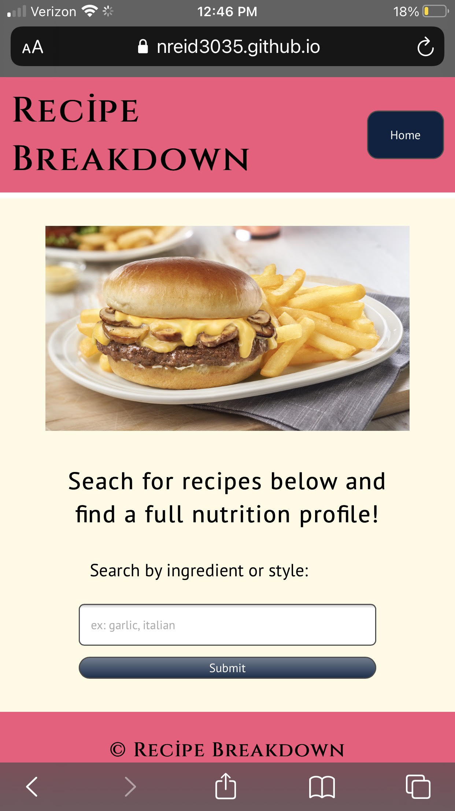
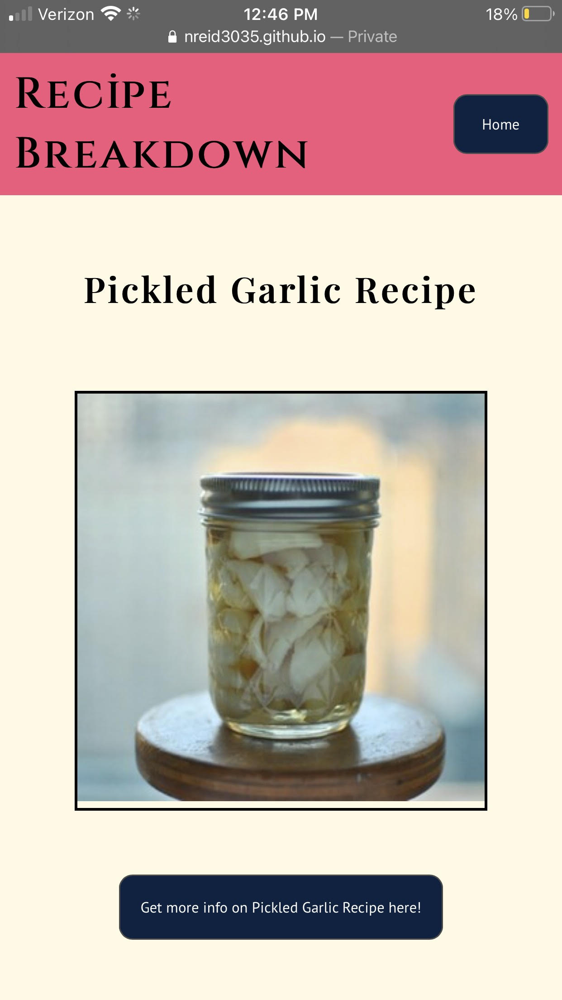
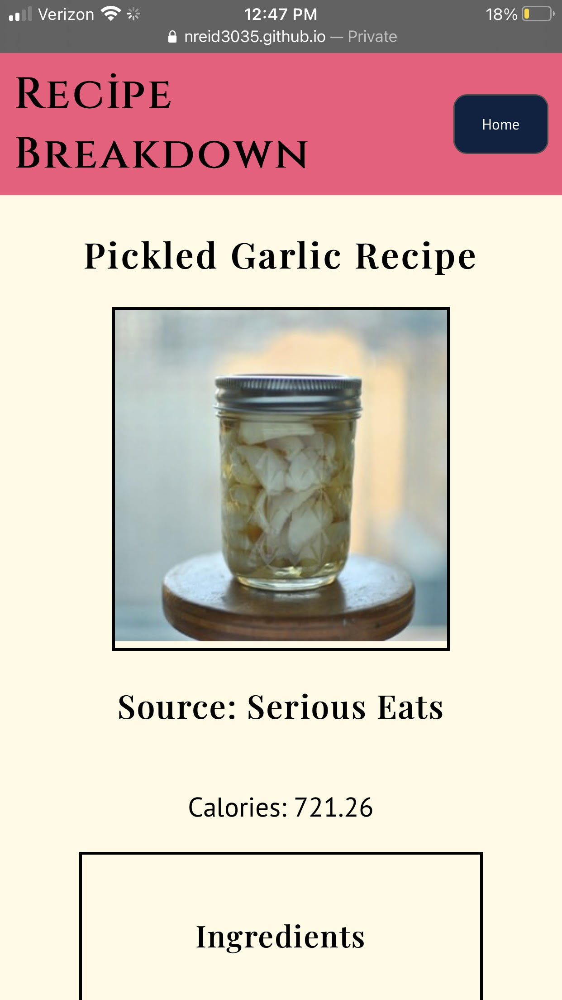
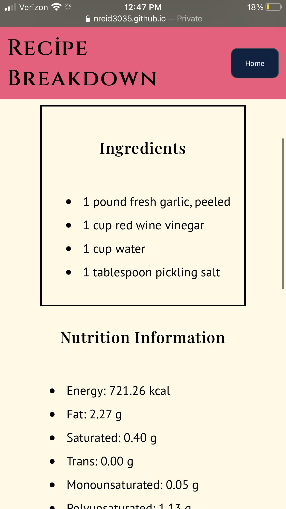
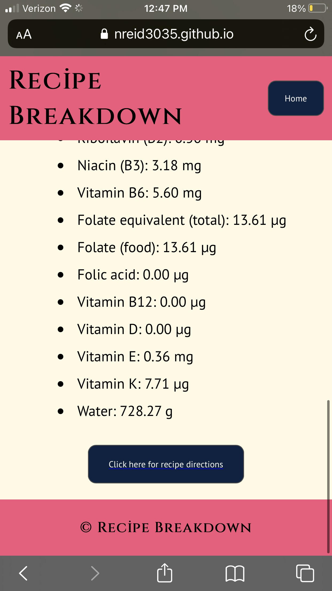

# Recipe Breakdown

link: nreid3035.github.io/recipe-breakdown

Recipe breakdown is a simple app who's main goal is to take search terms (ingredients, cuisine types) and return a list of recipes from the edamam recipe api. Upon selection of a recipe, you will be shown the ingredients, calories, nutrition facts and a link to the recipe page and directions. This app is useful to quickly browse for recipes based on ingredients you may have and don't know what to do with.

This is the home page where users can put in a search term and press the submit button to send their input to the api

The response page will present you with a list of responses including the title of the recipe, a photo of the recipe and a button to show you more details

Upon click of the button for recipe details you will see the title, the same image, the source of the recipe, the calories, an ingredient list, general nutrition information and a link to view the recipe directions on the original page.

## Technology

-HTML  
-CSS  
-JavaScript  
-jQuery  
